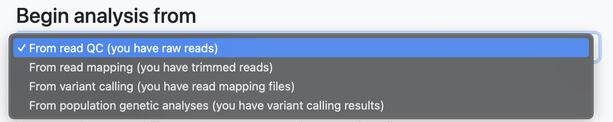
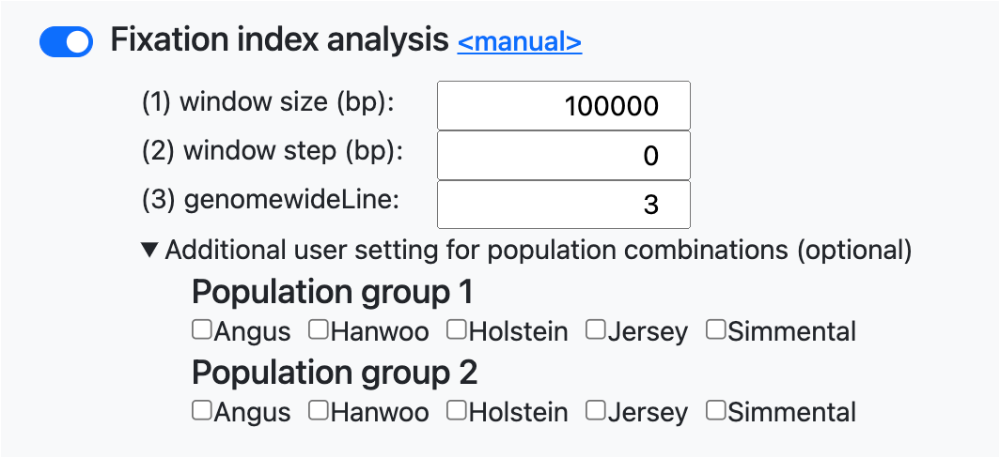

# Parameter File Generator

## Wegpage link 

[PAPipe Parameter File Generator](http://bioinfo.konkuk.ac.kr/PAPipe/parameter_builder/)

## Main web interface

## Documentation

### "Load parameter for test data" button

- Example parameter values for a test data are loaded in each field 

### "Clear" button

- Reset all parameter values 

### Global parameters

#### (1) Reference genome assembly file

- The name of a genome assembly file (gzip-compressed FASTA) of a reference species
- Example: pig.fa.gz

#### (2) Reference dbSNP file (optional)

- The dbSNP file (gzip-compressed VCF) of a reference species
- Optional parameter
- Example: pig.vcf.gz

#### (3) Total number of chromosomes in the reference genome

- Total number of chromosomes (including sex chromosomes) of in the reference genome
- Example: 23

#### (4) Number of autosomes in the reference genome

- Total number of autosomes in the reference genome
- Example: 21

#### (5) Names of sex chromosomes in the reference genome (optional)

- The list of the names of sex chromosomes in the reference genome
- Comma-separated without space
- Optional parameter
- Example: X,Y

#### (6) Name of output directory

- The name of output directory

#### (7) Threads

- The number of threads for parallel execution

### Population setting

- Names of populations
- One population name per line
- 아래에 test data population name 채워진 그림 부분 추가 후 이 글 삭제

### Begin analysis from

- Set the starting point of analysis
- Data in the "Input file setting" must be set differently based on the choice here

#### From read QC (you have raw reads)

- You have raw sequencing files and therefore you want to begin analysis from read QC and trimming
- In the "Input file setting" textbox, a sample name and corresponding sequencing file must be given (one pair per line)
- Only paired-end sequencing data is supported, therefore for one sample, two read files (one for the first reads and the other for the second reads) must be specified in two different lines
- Sequencing files must be gzip-compressed fastq files
- 아래 그림을 실제 data 가 채워진 (test data 활용) 그림으로 바꾸고 이 글 삭제

#### From read mapping (you have trimmed reads)

- You have trimmed sequencing files and therefore you want to begin analysis from read mapping (skip read QC and trimming)
- In the "Input file setting" textbox, a sample name and corresponding sequencing file must be given (one pair per line)
- Only paired-end sequencing data is supported, therefore for one sample, two read files (one for the first reads and the other for the second reads) must be specified in two different lines
- Sequencing files must be gzip-compressed fastq files
- 실제 data 가 채워진 (test data 활용) 그림 추가하고 이 글 삭제

#### From variant calling (you have read mapping files)

- You have read mapping files and therefore you want to begin analysis from variant calling (skip read QC, read trimming, and read mapping)
- In the "Input file setting" textbox, a sample name and corresponding mapping file must be given (one pair per line)
- The mapping file must be a BAM file
- 아래 그림을 실제 data 가 채워진 (test data 활용) 그림으로 바꾸고 이 글 삭제

#### From population genetic analyses (you have variant calling results)

- You have variant calling results and therefore you want to begin population genetic analyses (skip read QC, read trimming, read mapping, and variant calling)
- In the "Input variant file name" textbox, a variant calling result file (gzip-compressed VCF file) must be given
- In the "Input sample list" textbox, a sample name must be given (one per line)
- 아래 그림을 실제 data 가 채워진 (test data 활용) 그림으로 바꾸고 이 글 삭제

### Population setting for input files

A population name is assigned to each input data file in this part.

#### Requirements

- Population names must be given in the "Population setting" texbox as described above
- The names of samples and input files must be given in the "Input file setting" textbox as described above

#### Population setting 

- Click the "Population setting for input files" button to display the population setting table as shown above
- A population and sex information can be set for each input file separately by using the "Population" and "Sex" drop-down textbox
- A population and sex information can be set for multiple input files together by using the "Apply population" and "Apply sex" bottons and their related drop-down textbox (use mouse shift-click as described on the webpage)
- The sex information is optional and therefore leave them as "None" in that case (맞는지 확인 후 한글 삭제)

- In the example below, if you choose 'None' in the bottom selection box for the selected rows and click the 'Apply Sex' button, you can modify the gender values for all selected rows from 'Female' to 'None'.

### Parameter settting

- After completing the input files and population setting, you can select or modify the parameters necessary for pipeline execution.
- The parameters for the pipeline that need to be entered depend on the selected 'Begin analysis from' option at the top. This is automatically reflected on the webpage, eliminating the need for the user to consider this manually.
- PAPipe provides two options for read alignment and three options for variant calling. While PAPipe offers default execution, it also caters to users requiring advanced options by providing input forms for detailed parameters at each step.

### Population genetic analysis

- PAPipe supports 11 population genetic analyses. Users can selectively choose and execute the analyses they need during the analysis.
- Upon selecting each analysis, a user-customizable parameter input form for conducting that specific analysis appears.
- The form is typically pre-filled with default values for program execution.

### PAPipe-extension

**Drawing PCA plot until objective variance**

- PAPipe generates PCA plots for all pairwise PC pairs that can be created using all the PCs reaching the target variance.
- User can set the target explained variance using parameters such as 'Objective sum of the proportion of variance explained (%)' or 'Max PC,' or explicitly specify the PCs used for visualization.

**Repetitive execution for several analyses**

- To facilitate comprehensive analysis, PAPipe allows for the repetitive execution of the same analysis with different parameters.
- In the Population tree analysis, when given the 'm' parameter, the analysis will be repetitively executed for values ranging from 0 to the specified 'm' parameter.

- In Population Structure Analysis, the analysis is repetitively performed for values ranging from the minimum value of 'k' (2) to the specified 'k', returning results for each iteration.

- For Linkage Disequilibrium Decay Analysis, you can provide multiple values for the 'maxdist' parameter, separated by commas. PAPipe returns results for each execution with different 'maxdist' values.

**Default Fst and user combination**

- PAPipe inherently provides various combinations of FST analysis by default.
- PAPipe performs FST analysis for all possible pairs that can be created from the entered populations.
- PAPipe also performs the analysis by targeting one specific population from all the entered populations and comparing it against the rest of the populations as a control group. This is done by default.
- In addition, if the user has specific population combinations they want to compare, they can use the 'User Setting' at the bottom to add them.

### Clicking Generate paramter files button and get generated parameter files 
- Once the necessary parameter input is complete, click the 'Generate Parameter Files' button.
- After clicking that button, two new buttons will be generated at the bottom.
- When you click the 'Click the link of parameter files' button on the left, the link to download the generated parameters using wget will be copied to the clipboard.
- When you click the 'Download parameter files' button on the right, the download of the generated parameter files will begin.

