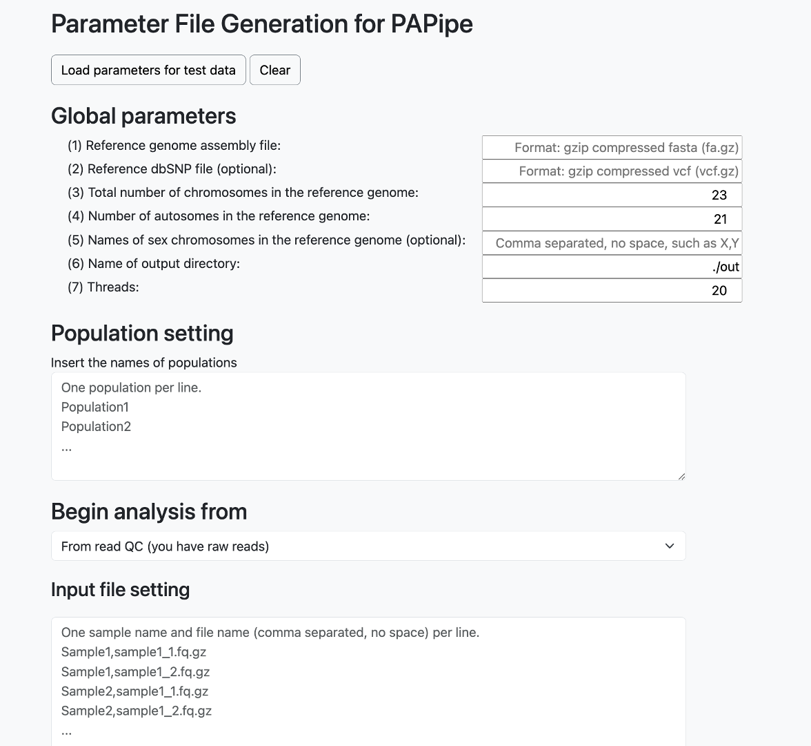
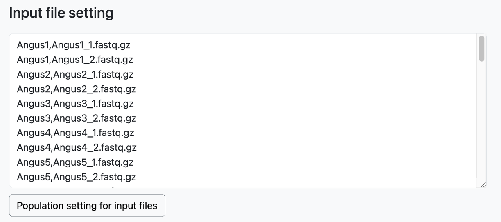
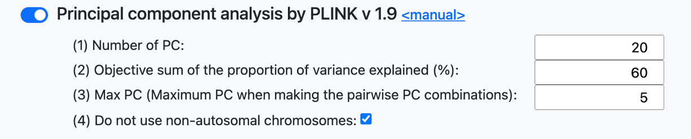

# Parameter File Generator

## Wegpage link 

[PAPipe Parameter File Generator](http://bioinfo.konkuk.ac.kr/PAPipe/parameter_builder/)

## Main web interface

## Documentation

### "Load parameter for test data" button

- Example parameter values for a test data are loaded in each field 

### "Clear" button

- Reset all parameter values 

### Global parameters

**(1) Reference genome assembly file**

- The name of a genome assembly file (gzip-compressed FASTA) of a reference species
- Example: pig.fa.gz

**(2) Reference dbSNP file (optional)**

- The dbSNP file (gzip-compressed VCF) of a reference species
- Optional parameter
- Example: pig.vcf.gz

**(3) Total number of chromosomes in the reference genome**

- Total number of chromosomes (including sex chromosomes) of in the reference genome
- Example: 23

**(4) Number of autosomes in the reference genome**

- Total number of autosomes in the reference genome
- Example: 21

**(5) Names of sex chromosomes in the reference genome (optional)**

- The list of the names of sex chromosomes in the reference genome
- Comma-separated without space
- Optional parameter
- Example: X,Y

**(6) Name of output directory**

- The name of output directory

**(7) Threads**

- The number of threads for parallel execution

### Population setting

- Names of populations
- One population name per line
- 아래에 test data population name 채워진 그림 부분 추가 후 이 글 삭제

### Begin analysis from

- Set the starting point of analysis
- Data in the "Input file setting" must be set differently based on the choice here

**From read QC (you have raw reads)**

- You have raw sequencing files and therefore you want to begin analysis from read QC and trimming
- In the "Input file setting" textbox, the names of a sample and its corresponding sequencing file must be given (one pair per line)
- Only paired-end sequencing data is supported, therefore for one sample, two read files (one for the first reads and the other for the second reads) must be specified in two different lines
- Sequencing files must be gzip-compressed fastq files
- 아래 그림을 실제 data 가 채워진 (test data 활용) 그림으로 바꾸고 이 글 삭제

**From read mapping (you have trimmed reads)**

- You have trimmed sequencing files and therefore you want to begin analysis from read mapping (skip read QC and trimming)
- In the "Input file setting" textbox, the names of a sample and its corresponding sequencing file must be given (one pair per line)
- Only paired-end sequencing data is supported, therefore for one sample, two read files (one for the first reads and the other for the second reads) must be specified in two different lines
- Sequencing files must be gzip-compressed fastq files
- 실제 data 가 채워진 (test data 활용) 그림 추가하고 이 글 삭제

**From variant calling (you have read mapping files)**

- You have read mapping files and therefore you want to begin analysis from variant calling (skip read QC, read trimming, and read mapping)
- In the "Input file setting" textbox, the names of a sample and its corresponding mapping file must be given (one pair per line)
- The mapping file must be a BAM file
- 아래 그림을 실제 data 가 채워진 (test data 활용) 그림으로 바꾸고 이 글 삭제

**From population genetic analyses (you have variant calling results)**

- You have variant calling results and therefore you want to begin population genetic analyses (skip read QC, read trimming, read mapping, and variant calling)
- In the "Input variant file name" textbox, a single variant calling result file (gzip-compressed VCF file) must be given
- In the "Input sample list" textbox, a sample name must be given (one per line)
- 아래 그림을 실제 data 가 채워진 (test data 활용) 그림으로 바꾸고 이 글 삭제

### Population setting for input files

A population name is assigned to each input data file in this part.

**Requirements**

- Population names must be given in the "Population setting" texbox as described above
- The names of samples and input files must be given in the "Input file setting" textbox as described above

**Population setting** 

- Click the "Population setting for input files" button to display the population setting table as shown above
- A population and sex information can be set for each input file separately by using the "Population" and "Sex" drop-down textbox
- A population and sex information can be set for multiple input files together by using the "Apply population" and "Apply sex" bottons and their related drop-down textbox (use mouse shift-click as described on the webpage)
- The sex information is optional and therefore leave them as "None" in that case (맞는지 확인 후 한글 삭제)

### Parameter settting for read QC, read alignment, variant calling, and post processing

- Parameter values for read QC, read alignment, variant calling, and post processing can be set using textboxes shown above
- Read alignment can be done by BWA or Bowtie 2
- Variant calling can be done by GATK3, GATK4, or BCFtools
- Additional parameters can be set by clicking "Additional user parameters (optional)"
- The description of available parameters can be obtained by clicking the "manual" link 

### Population genetic analysis

아래 그림들 PLINK 표기 수정된 그림으로 대체 (그림들 전체 중 해당되는 그림 모두 대체)

- A total of 11 population genetic analyses can be simultaneously run by using the on/off button shown above

### Parameter setting for population genetic analysis

- The description of most parameters can be found from the manual page of each tool (click the "manual" link)
- The description of PAPipe-specific parameters are shown below

**Principal component analysis**

아래 설명들 중 PAPipe 에서 만든것이 아닌것들(즉 기존 tool 의 parameter인것들)은 삭제하도록

- Number of PC: the total number of PCs generated by this analysis
- Objective sum of the proportion of variance explained (%): the cutoff value of the sum of the proportion of variance explained (PVE), only top PCs that their PVE sum satisfies this cutoff are used
- Max PC: only this number of top PCs are used to create the PCA plots between two PCs

**Population tree analysis**

- m (maximum number of migration edges to add): PAPipe runs the TreeMix program multiple times by using different values of the number of migration edge parameter (from 0 to a given number).

**Population tree analysis**

- k (maximum number of ancestors): PAPipe runs the ADMIXTURE program multiple times by using different values of the number of ancestor parameter (from 2 to a given number).

**Linkage disequilibrium decay analysis**

- MaxDist (bp) (ex: 500,1000,5000,10000): PAPipe runs the PopLDdecay program multiple times by using different values of the maxdist parameter (for given numbers separated by comma)

**Default Fst and user combination**

- PAPipe inherently provides various combinations of FST analysis by default.
- PAPipe performs FST analysis for all possible pairs that can be created from the entered populations.
- PAPipe also performs the analysis by targeting one specific population from all the entered populations and comparing it against the rest of the populations as a control group. This is done by default.
- In addition, if the user has specific population combinations they want to compare, they can use the 'User Setting' at the bottom to add them.

### Clicking Generate paramter files button and get generated parameter files 
- Once the necessary parameter input is complete, click the 'Generate Parameter Files' button.
- After clicking that button, two new buttons will be generated at the bottom.
- When you click the 'Click the link of parameter files' button on the left, the link to download the generated parameters using wget will be copied to the clipboard.
- When you click the 'Download parameter files' button on the right, the download of the generated parameter files will begin.

