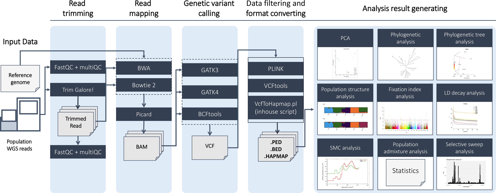

# PAPipe: a comprehensive pipeline for population genetic analysis



### Main workflow

1. Read trimming (by [Trim Galore](https://www.bioinformatics.babraham.ac.uk/projects/trim_galore/))
2. Read mapping (by [BWA](https://bio-bwa.sourceforge.net/) or [Bowtie 2](https://bowtie-bio.sourceforge.net/bowtie2/))
3. Genetic variant calling (by [GATK3](https://gatk.broadinstitute.org/hc/en-us), [GATK4](https://gatk.broadinstitute.org/hc/en-us) or [BCFtools](https://github.com/samtools/bcftools))
4. Data filtering and format converting (by [PLINK v 1.9](https://www.cog-genomics.org/plink/))
5. Population genetic analyses
    - Principal component analysis (by [PLINK v 1.9](https://www.cog-genomics.org/plink/) or [PLINK v 2.0](https://www.cog-genomics.org/plink/2.0/))
    - Phylogenetic tree analysis (by [SNPhylo](https://github.com/thlee/SNPhylo))
    - Population tree analysis (by [TreeMix](https://bitbucket.org/nygcresearch/treemix/wiki/Home))
    - Population structure analysis (by [ADMIXTURE](https://speciationgenomics.github.io/ADMIXTURE/))
    - Linkage disequilibrium decay analysis (by [PopLDdecay](https://github.com/BGI-shenzhen/PopLDdecay/))
    - Selective sweep analysis (by [SweepFinder2](http://degiorgiogroup.fau.edu/sf2.html))
    - Population admixture analysis (by [AdmixTools](https://github.com/DReichLab/AdmixTools))
    - Pairwise sequentially Markovian coalescent analysis (by [psmc](https://github.com/lh3/psmc))
    - Multiple sequentially Markovian coalescent analysis (by [msmc2](https://github.com/stschiff/msmc2))
    - Fixation index analysis (by [VCFtools](https://vcftools.sourceforge.net/))

---

### Install a Docker Engine (Need root permission)

Skip if your machine already has the engine ([Installation document](https://docs.docker.com/engine/install/)). 

```bash
curl -fsSL https://get.docker.com/ | sudo sh
```

### Add a Docker user to the docker group (Need root permission)

Skip if your account is already added in the docker group

```bash
sudo usermod -aG docker $USER 	
```

### Install the PAPipe Docker image

```bash
wget http://bioinfo.konkuk.ac.kr/PAPipe/bin/PAPipe.tar.gz    # Download the Docker image file
docker load -i ./PAPipe.tar.gz    # Load the Docker image file
docker image ls    # Check if the image loaded well ("REPOSITORY:pap_docker, TAG:latest" must be shown)
```

### Run PAPipe

**Setting local input directories (Caution: do not change the names and the directory structure)** 

```bash
mkdir RUN_DOCKER/
cd RUN_DOCKER/

mkdir data/
cd data/

mkdir ref/
mkdir input/
```

- Place the following two files of a reference species in `RUN_DOCKER/data/ref/`
    - Genome assembly file (gzip-compressed FASTA file with an extension .fa.gz)
    - dbSNP VCF file (gzip-compressed VCF file with an extension .vcf.gz)
      
- Place all other input data (read sequence files, read mapping files, or variant calling files) in `RUN_DOCKER/data/input/`
    - First, create separate directory for each population (one per population) in the "input" directory
    - Then, place files of each population in its directory (example below)
        - Files for Angus in `RUN_DOCKER/data/input/Angus/`
        - Files for Jersey in `RUN_DOCKER/data/input/Jersey/`

**Preparing parameter files** 

PAPipe requires the following three parameter files

- main_sample.txt: setting for populations and samples 
- main_input.txt: setting for input data files
- main_param.txt: controlling parameters for PAPipe including various tools in PAPipe

The above three files must be placed in the above "RUN_DOCKER" directory. 

You can easily generate the parameter files using our [parameter file genetator](http://bioinfo.konkuk.ac.kr/PAPipe/parameter_builder/).

Check out more details about the parameter file generator [here](./Parameters/parameter_generator.md).

**Creating a Docker container that mounts the above "RUN_DOCKER" directory** 

```bash
docker run -v [absolute path of the "RUN_DOCKER" directory]:/RUN_DOCKER/  -it pap_docker:latest
```

**Running PAPipe inside the Docker container** 

```bash
# Run in the docker container
cd /RUN_DOCKER/
python3 /PAPipe/bin/main.py  -P ./main_param.txt  -I ./main_input.txt -A ./main_sample.txt &> ./log
```

**Generating HTML pages for browsing analysis results** 

```bash
# Run in the docker container
perl /PAPipe/bin/webEnvSet.pl ./out &> webenvset.log # ./out is the output directory set in the PAPipe parameter file
cd ./out/web/
python3 /PAPipe/bin/html/html/select_input.py /PAPipe/bin/html/html/pre_index.html &> ./webgen.log
```


---

### Results of PAPipe

1. Trimmed read data
    - Trimmed read data for all samples
        
        ```
        /Path_to_out_directory/00_ReadQC/TrimmedData/[sample]_1_val_1.fq.gz
        /Path_to_out_directory/00_ReadQC/TrimmedData/[sample]_2_val_2.fq.gz
        
        ```
        
    - fastQC results for all samples before and after trimming
        
        ```
        /Path_to_out_directory/00_ReadQC/QC_Report_Before_Trimming/[population]/[sample]_1_fastqc.html
        /Path_to_out_directory/00_ReadQC/QC_Report_Before_Trimming/[population]/[sample]_2_fastqc.html
        
        ```
        
    - MultiQC summarized QC results for populations before and after trimming
        
        ```
        /Path_to_out_directory/00_ReadQC/QC_Report_Before_Trimming/[population]/multiqc_report.html
        
        ```
        
2. Read alignment data
    - Read mapping files for all samples
        
        ```
        /Path_to_out_directory/01_readMapping/04ReadRegrouping/[population]_[sample].addRG.marked.sort.bam
        
        ```
        
3. Variant call data
    - Variant call generated using all population sequencing data
        
        ```
        /Path_to_out_directory/02_VariantCalling/VariantCalling/[].All.variant.combined.g.vcf.gz
        
        ```
        
4. Post-processed data
    - Variant call gone through Hapmap format conversion/Plink filtering
        
        ```
        /Path_to_out_directory/03_Postprocessing/Hapmap/variant.combined.GT.SNP.flt.hapmap
        /Path_to_out_directory/03_Postprocessing/plink/[prefix].*
        
        ```
        
5. Population analysis
    1. principal component analysis (Plink 1.9)
        - PCA results
            
            ```
            /Path_to_out_directory/04_Population/[running datetime]/PCA/PCs.info
            
            ```
            
        - PCA plots of all available combination of two PCs
            
            ```
            /Path_to_out_directory/04_Population/[running datetime]/PCA/all.PCA.pdf
            
            ```
            
    2. PCA projection analysis (Plink 2)
        - PCA results
            
            ```
            /Path_to_out_directory/04_Population/[running datetime]/PCA/PCs.info
            
            ```
            
    3. Phylogenetic analysis (Snphylo)
        - .NEWICK formatted phylogenetic tree
            
            ```
            /Path_to_out_directory/04_Population/[running datetime]/SNPhylo/snphylo.ml.txt
            
            ```
            
        - Visualized phylogenetic tree
            
            ```
            /Path_to_out_directory/04_Population/[running datetime]/SNPhylo/snphylo.ml.png
            
            ```
            
    4. Treemix analysis (Treemix2)
        - Treemix results in a single PDF file
            
            ```
            /Path_to_out_directory/04_Population/[running datetime]/Treemix/Treemix.results.pdf
            
            ```
            
    5. Population structure analysis (Structure)
        - STRUCTURE results per K in .PNG files and all STRUCTURE results in a single PDF file
            
            ```
            /Path_to_out_directory/04_Population/[running datetime]/STRUCTURE/CLUMPAK/K=[n].MajorCluster.png
            
            ```
            
        - STRUCTURE results for all K in single .PDF file
            
            ```
            /Path_to_out_directory/04_Population/[running datetime]/STRUCTURE/CLUMPAK/pipeline_summary.pdf
            
            ```
            
    6. Linkage disequilibrium decay analysis (PopLDdecay)
        - Linkage disequilibrium decay results for each maximum distance parameter
            
            ```
            /Path_to_out_directory/04_Population/[running datetime]/LdDecay/[maxDist]/Plot/out.pdf
            
            ```
            
    7. Selective sweep finding analysis (SweepFinder2)
        - Selective Sweep results in point plot figures for all chromosom generated per population
            
            ```
            /Path_to_out_directory/04_Population/[running datetime]/SweepFinder2/[population]/SweepFinderOut.pdf
            
            ```
            
        - Selective Sweep results per population and per chromosome
            
            ```
            /Path_to_out_directory/04_Population/[running datetime]/SweepFinder2/[population]/[population].[chromosome].SF2out
            
            ```
            
    8. Population admixture analysis (Admixtools)
        - Admixture analysis results
            
            ```
            /Path_to_out_directory/04_Population/[running datetime]/ADMIXTOOLS/admixtools_3pop/result.out
            /Path_to_out_directory/04_Population/[running datetime]/ADMIXTOOLS/admixtools_4diff/result.out
            /Path_to_out_directory/04_Population/[running datetime]/ADMIXTOOLS/admixtools_f4stat/result.out
            /Path_to_out_directory/04_Population/[running datetime]/ADMIXTOOLS/admixtools_Dstat/result.out
            
            ```
            
    9. Pairwise sequentially Markovian coalescent analysis (PSMC)
        - Effective Size plot
            
            ```
            /Path_to_out_directory/04_Population/[running datetime]/EffectiveSize/psmc_plot.pdf
            
            ```
            
    10. Multiple sequentially Markovian coalescent analysis (MSMC)
        - Effective Size plot
            
            ```
            /Path_to_out_directory/04_Population/[running datetime]/MSMC/MSMC.pdf
            
            ```
            
    11. Fixation index analysis (Fst)
        - Fixation index results visualized in manhatton plot figures
            
            ```
            /Path_to_out_directory/04_Population/[running datetime]/Fst/[pair information]/Fst_result.pdf
            
            ```
            
        - Significant regions results of Fst analysis
            
            ```
            /Path_to_out_directory/04_Population/[running datetime]/Fst/[comparing pair information]/[comparing pair information].sig.region.txt
            
            ```
