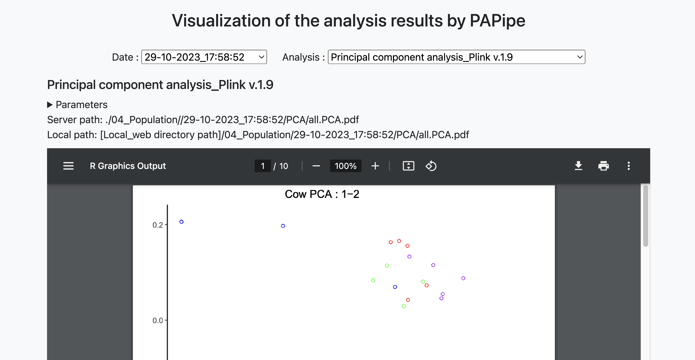
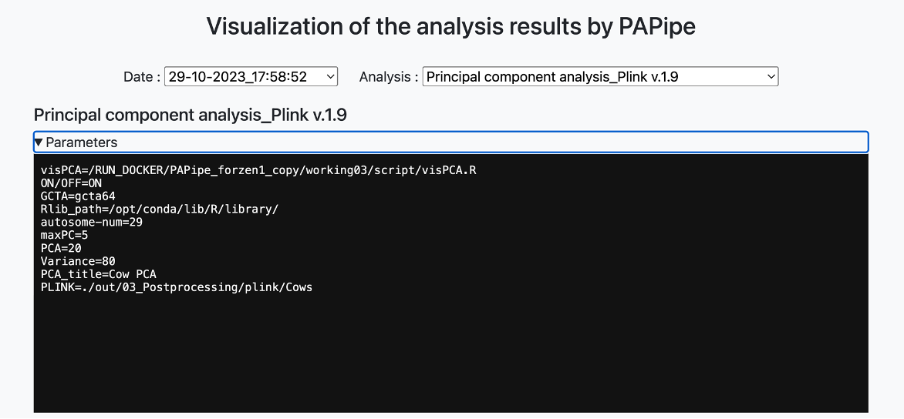

# Analysis result browser

### Explore the Result browsing webpage

PAPipe assumes the repetitive execution of population genetic analysis with various arguments using the same input. When executing a population genetic analysis, it takes the date at the execution time as the directory name and creates results accordingly. Therefore, users can review all the results from multiple executions with different parameters on this webpage.

Below the title, there are two select boxes for selecting the execution date and the analysis. Upon selecting each, you can retrieve the parameter file and results used in the analysis.

The parameters used during program execution are initially hidden, and clicking the corresponding button reveals the options and details used during the execution.

Below the parameter information, webpage provides both server-side, execution location path or webpage based relative path of the results allowing users to easily verify the exact location of specific results.
