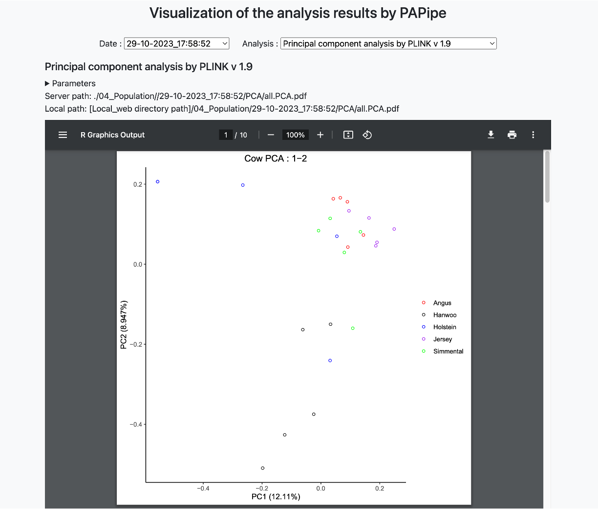

# Analysis result browser

## Main web interface

**"Date" drop-down box**

- PAPipe can be run multiple times with different parameter settings, and can generate analysis results into the same output directory
- In this case, PAPipe create a sub-directory with a date for its name for each run, and stores analysis results in that sub-directory
- By using this drop-down box, user can navigate analysis results generate at different time point

**"Analysis" drop-down box**

- By using this drop-down box, user can select a specific analysis and visualize the result
- Only the analysis performed at each time point can be seen and selected in this drop-down box

**Parameter section**

- Parameter values used for this run can be seen by clicking the 

The parameters used during program execution are initially hidden, and clicking the corresponding button reveals the options and details used during the execution.

Below the parameter information, webpage provides both server-side, execution location path or webpage based relative path of the results allowing users to easily verify the exact location of specific results.
